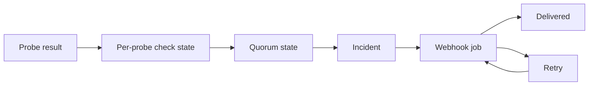

# Alerts And Quorum

Wacht opens and resolves incidents from probe agreement, not from a single
check result.



## Check States

An aggregate check can be:

- `pending`: not enough evidence yet
- `up`: enough probes currently report healthy evidence
- `down`: enough probes currently report failing evidence
- `error`: evidence is missing or degraded after a previous stable state

Probe states are:

- `online`: recent heartbeat received
- `offline`: heartbeat is older than `probe_offline_after`
- `error`: probe-level error state

## Quorum Rule

Wacht uses a strict majority of assigned probes.

For example:

| Assigned probes | Majority |
| --- | --- |
| 1 | 1 |
| 2 | 2 |
| 3 | 2 |
| 4 | 3 |
| 5 | 3 |

Run at least three probes if you want the product promise of avoiding pages
from a single flaky probe. One-probe monitoring works as a simple health check,
but it is not distributed quorum monitoring.

## Incident Opening

A probe contributes a down vote only after two consecutive down results for a
check.

An incident opens when:

- the check previously had stable `up` state
- a strict majority of assigned probes have down evidence
- the aggregate down state is observed on consecutive recomputes

The incident is recorded in the database and appears in incident history.

## Recovery

Recovery also requires quorum. During an open incident, up evidence is gated so
one quick healthy result does not immediately resolve the outage.

An incident resolves when enough probes have healthy or non-down evidence for
the aggregate state to return to stable `up`.

## Evidence Expiry

Each check result has a freshness deadline based on the check interval:

```text
expires_at = observed_at + 2 * interval
```

The server sweeps stale check evidence once per second after startup grace. A
probe heartbeat is considered stale after `probe_offline_after`, which defaults
to `90s`.

## Webhooks

Webhook alerts fire on stable state transitions:

- `up` to `down`
- `down` to `up`

Payload:

```json
{
  "check_id": "550e8400-e29b-41d4-a716-446655440000",
  "check_name": "website",
  "target": "https://example.com",
  "status": "down",
  "probes_down": 2,
  "probes_total": 3
}
```

Recovery notifications use the same shape with `"status": "up"`.

Webhook delivery is durable:

- result ingestion records the notification work in Postgres
- background workers deliver webhook jobs
- failed deliveries retry with backoff up to 5 minutes
- HTTP delivery times out after 5 seconds
- stale pending down notifications are superseded if the incident resolves
  before delivery

Delivery state is visible in incident history.

## Webhook Destination Policy

Webhook URLs must use `http` or `https`. Userinfo is rejected. Private,
loopback, and link-local destinations are blocked unless private targets are
explicitly allowed by policy.
