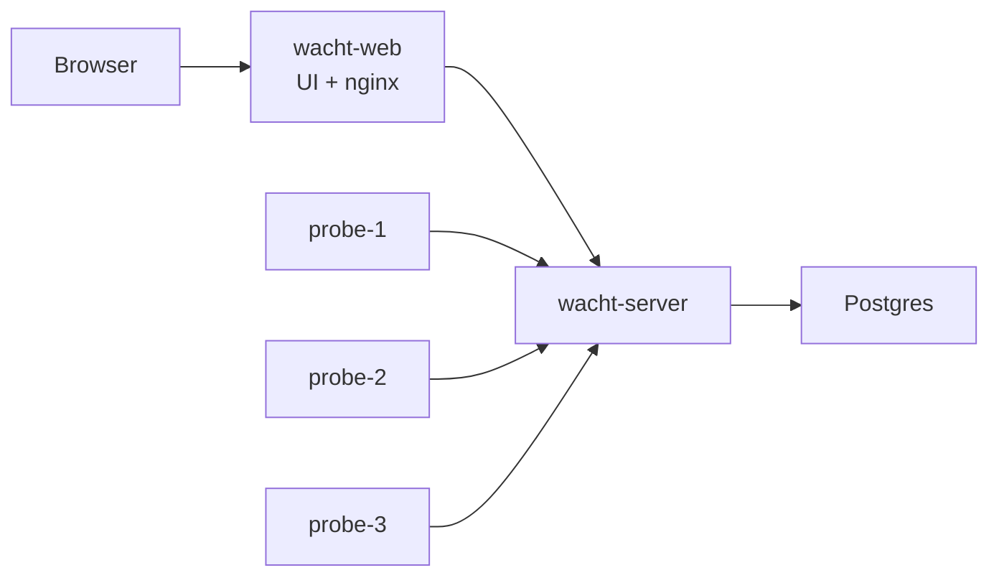

# All-In-One Docker Compose Install

This install runs Postgres, the Wacht server, three local probes, and the web
UI using published GHCR images.



## Requirements

- Docker
- Docker Compose
- A domain and reverse proxy if you want public HTTPS access

## Create Files

This block creates the directory, generates the required secrets, downloads the
Compose example, and starts the stack.

```sh
# Create the working directory.
mkdir wacht
cd wacht

# Generate local credentials.
POSTGRES_PASSWORD="$(openssl rand -hex 24)"
SEED_USER_EMAIL="you@example.com"
SEED_USER_PASSWORD="$(openssl rand -hex 18)"
PROBE_1_SECRET="$(openssl rand -hex 32)"
PROBE_2_SECRET="$(openssl rand -hex 32)"
PROBE_3_SECRET="$(openssl rand -hex 32)"

# Write database secrets consumed by compose.yaml.
mkdir -p secrets
printf '%s\n' "${POSTGRES_PASSWORD}" > secrets/wacht_postgres_password
printf 'postgres://wacht:%s@postgres/wacht?sslmode=disable\n' \
  "${POSTGRES_PASSWORD}" > secrets/wacht_database_dsn

# Write the values consumed by compose.yaml.
cat > .env <<EOF
SEED_USER_EMAIL=${SEED_USER_EMAIL}
SEED_USER_PASSWORD=${SEED_USER_PASSWORD}
PROBE_1_SECRET=${PROBE_1_SECRET}
PROBE_2_SECRET=${PROBE_2_SECRET}
PROBE_3_SECRET=${PROBE_3_SECRET}
WACHT_WEB_PORT=127.0.0.1:3000
EOF

# Download the example stack.
curl -fsSL https://wacht.cloud/examples/compose.yaml \
  -o compose.yaml

# Keep the first login credentials locally.
cat > credentials.txt <<EOF
Admin email: ${SEED_USER_EMAIL}
Admin password: ${SEED_USER_PASSWORD}
EOF

# Restrict files containing secrets.
chmod 600 .env credentials.txt secrets/*

# Start Wacht.
docker compose up -d
```

The seed user is only created on first boot when no users exist yet. `.env`,
`credentials.txt`, and `secrets/` contain secrets; do not commit or share them.

## Private Targets

The example enables private targets because self-hosted probes often monitor
Docker, VPN, LAN, or other RFC1918 services.

Disable `allow_private_targets` on both the server and probes when probes
should only reach public destinations.

Open:

```text
http://localhost:3000
```

The web container proxies `/api`, `/status`, and `/healthz` to the server.
The server is only exposed inside the Compose network.

## Public HTTPS

The example binds the web UI to `127.0.0.1:3000`. Put Caddy or Nginx in front:

```caddy
wacht.example.com {
  reverse_proxy 127.0.0.1:3000
}
```

Let the reverse proxy handle TLS on ports `80` and `443`. Do not expose
Postgres publicly.

## Verify

Health check:

```sh
curl http://127.0.0.1:3000/healthz
```

Login API:

```sh
ADMIN_EMAIL="$(awk -F': ' '/Admin email/ {print $2}' credentials.txt)"
ADMIN_PASSWORD="$(awk -F': ' '/Admin password/ {print $2}' credentials.txt)"

curl -s -X POST http://127.0.0.1:3000/api/auth/login \
  -H 'Content-Type: application/json' \
  -d "{\"email\":\"${ADMIN_EMAIL}\",\"password\":\"${ADMIN_PASSWORD}\"}"
```

After verifying the install, sign in and change the generated password.

## Stop

Stop containers and keep data:

```sh
docker compose down
```

Stop containers and remove the database volume:

```sh
docker compose down -v
```

Use `down -v` only when you intentionally want a clean slate.
