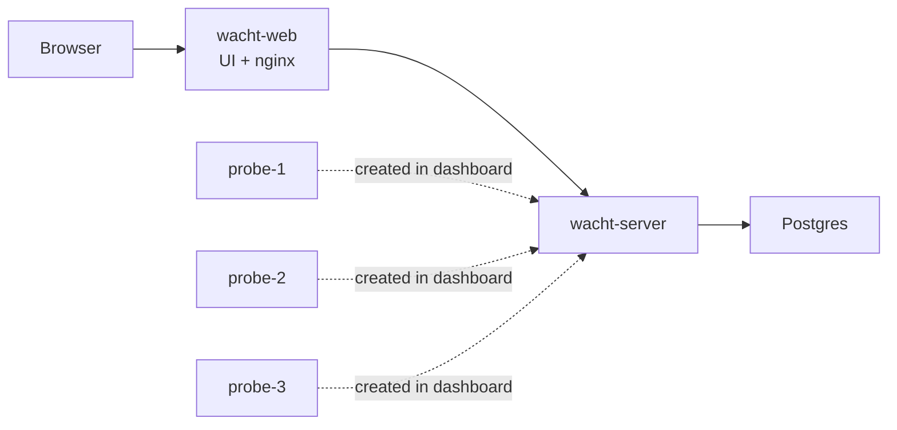

# Server-First Docker Compose Install

This install starts Postgres, the Wacht server, and the web UI first. Probes
are created from the dashboard and started one at a time.



## Requirements

- Docker
- Docker Compose
- A domain and reverse proxy if probes will run on other machines

## Start Server And Web

This block creates the directory, generates the admin credentials, downloads
the Compose example, and starts only the server-side services.

```sh
# Create the working directory.
mkdir wacht
cd wacht

# Generate local credentials.
POSTGRES_PASSWORD="$(openssl rand -hex 24)"
SEED_USER_EMAIL="you@example.com"
SEED_USER_PASSWORD="$(openssl rand -hex 18)"

# Write the values consumed by compose.yaml.
cat > .env <<EOF
POSTGRES_PASSWORD=${POSTGRES_PASSWORD}
SEED_USER_EMAIL=${SEED_USER_EMAIL}
SEED_USER_PASSWORD=${SEED_USER_PASSWORD}
WACHT_WEB_PORT=127.0.0.1:3000
EOF

# Download the example stack.
curl -fsSL https://wacht.cloud/examples/compose.yaml \
  -o compose.yaml

# Keep the first login credentials locally.
cat > credentials.txt <<EOF
Admin email: ${SEED_USER_EMAIL}
Admin password: ${SEED_USER_PASSWORD}
EOF

# Restrict files containing secrets.
chmod 600 .env credentials.txt

# Start only the server-side services.
docker compose up -d postgres server wacht-web
```

Open:

```text
http://localhost:3000
```

Sign in with the credentials in `credentials.txt`. `.env` and
`credentials.txt` contain secrets; do not commit or share them.

## Create Probe Credentials

Create `probe-1`, `probe-2`, and `probe-3` from the dashboard. Copy each
generated secret before leaving the page.

## Start Probes

Paste the generated secrets into this block, then run it from the same
directory as `compose.yaml`.

```sh
# Add the dashboard-generated probe secrets.
cat >> .env <<'EOF'
PROBE_1_SECRET=paste-generated-secret-for-probe-1
PROBE_2_SECRET=paste-generated-secret-for-probe-2
PROBE_3_SECRET=paste-generated-secret-for-probe-3
EOF

# Keep the updated .env private.
chmod 600 .env

# Start probes one at a time without recreating the server.
docker compose up -d --no-deps probe-1
docker compose up -d --no-deps probe-2
docker compose up -d --no-deps probe-3
docker compose ps
```

The dashboard should show each probe online after its first heartbeat.

After verifying the install, change the generated admin password.

## Remote Probes

For probes running on another machine, use the public Wacht URL instead of the
internal Compose URL:

```yaml
server: https://wacht.example.com
probe_id: probe-remote-1
secret: replace-with-the-generated-secret
heartbeat_interval: 30s
```

Run the probe container on that machine:

```sh
docker run -d --name wacht-probe \
  --restart unless-stopped \
  -v "$PWD/probe.yaml:/etc/wacht/probe.yaml:ro" \
  ghcr.io/tmater/wacht-probe:0.1 --config=/etc/wacht/probe.yaml
```

Remote probes need network access to the Wacht web origin. The web container
forwards `/api` to the server.

## Stop

```sh
docker compose down
```

Remove the database volume only when you intentionally want a clean slate:

```sh
docker compose down -v
```
